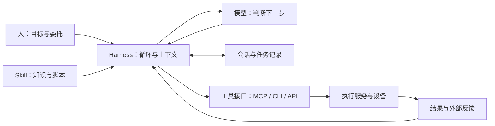

# 从模型到持续工作的系统：OpenAI、Anthropic 与社区的演化

资料核对：2026 年 9 月 27 日。

这份梳理回答三个问题：模型、Agent 和 harness 为什么先后成为重点；它们怎样相互改变；沿着已经发生的变化，未来五至十年有哪些值得跟踪的路径。最后单独讨论 Agent Device Cloud（ADC），不把行业趋势直接当成项目成功的证明。

文中有日期的事件来自论文、官方发布和工程记录；对商业动机与后续方向的解释属于分析。当前项目文档只能证明当前设计，不能据此倒推它在早期就有同样能力。厂商实验与产品说明也不等同于独立的生产可靠性验证。

## 1. 先把容易混在一起的东西分开

| 概念               | 在系统里负责什么                                                   | 例子与边界                                                      |
| ------------------ | ------------------------------------------------------------------ | --------------------------------------------------------------- |
| Model，模型        | 从输入中判断、生成、选择动作；训练可以提高推理、感知和工具使用能力 | GPT、Claude、开放权重模型；模型输出工具调用，不等于已经执行     |
| Agent，智能体      | 围绕任务持续观察、决策、行动，根据结果改变下一步                   | 一个能读仓库、改文件、跑检查并处理失败的编码 Agent              |
| Harness，运行框架  | 驱动模型循环，组织上下文，调用工具，处理会话、停止、恢复与反馈     | Claude Code 一类产品中的执行框架；也可以是很小的一段程序        |
| Workflow，工作流   | 用预设流程控制步骤、分支和校验，其中可以调用模型或 Agent           | 先校验订单再提交；成熟步骤适合固定下来，并不因 Agent 出现而过时 |
| Skill，技能包      | 提供任务做法、领域知识、脚本与资源，按需加载                       | 一套财务报表操作规范；它本身不授予设备权限                      |
| MCP 等连接协议     | 规定应用怎样发现、调用工具和获取上下文                             | 让不同客户端接同一个工具服务；不负责完成整个任务                |
| 执行环境与设备服务 | 提供实际文件、进程、计算和设备操作，并维护相应生命周期             | 本地电脑、云沙箱、实验仪器网关；ADC 主要在这一侧                |
| 用户产品           | 包装上述能力，管理入口、账户、任务、成果和协作                     | 聊天应用、IDE、工作台、企业应用；一个产品通常跨越多个技术层     |

这里的 harness 指 Agent 的运行框架。论文里的 evaluation harness 有时指测试框架，两者不能一概而论。行业也没有一条公认且固定的 harness 边界：有些实现把存储、沙箱和权限都包进去，有些将它们拆成外部服务。

Agent 也不是模型之后的下一代物种。更准确的关系是：**模型提供能力，harness 把能力组织成可运行的 Agent，Agent 在环境里完成任务。** 模型更新、harness 改造和环境改善，都可能提高同一个 Agent 的表现。[S28]

这张图表示职责，不要求所有系统都按这些模块部署。端到端训练可以吸收一部分判断逻辑，但实际执行、状态保存与外部反馈仍需要某种实现。

## 2. 历史主线：每次扩展，究竟解决了什么

### 2020—2022：通用模型获得了普通人能使用的入口

GPT-3 在 2020 年展示了一个重要变化：很多任务可以通过输入中的说明和示例切换，而不必为每个任务单独训练模型。它仍有明显的能力与评估局限，但“同一个模型能做许多事”开始成为产品基础。[S01]

2022 年的 ChatGPT 将指令跟随、对话训练和交互界面结合起来。用户不必先学会设计补全文本，而能直接提出要求、补充条件、纠正答案。这里发生的同时是能力变化与使用方式变化。[S02]

Anthropic 在同期研究 Constitutional AI，让模型参与批评、修订与偏好反馈，探索如何降低部分训练对人工标注的依赖。这是训练方法的一条路线；它不等于给运行中的程序装上不可绕过的权限系统。[S03]

这一阶段留下的新问题是：回答已经很有用，用户接着会问，能不能把答案放进我的文档、查询我的数据、替我完成那件事？

### 2022—2024：从生成回答，走到行动后的反馈循环

ReAct 在 2022 年把推理与行动交替组织：查询环境、取得观察，再据此继续。它说明 Agent 的关键不在于模型自称“规划者”，而在于判断能被外部结果不断修正。[S04]

2023 年，OpenAI 发布 function calling：模型可以输出函数名称与结构化参数，由应用执行后把结果送回去。这让工具使用更容易产品化，但执行仍发生在模型之外。[S05]

社区很快把这些能力组装成各种自动执行系统。AutoGPT 代表了开放目标加循环的早期探索；LangChain 帮开发者连接模型、检索与工具。随后，问题从“能不能循环”变成“怎样控制循环”。LangGraph 在 2024 年的发布文章正面解释了这一需求：引入有状态的循环图，让开发者在模型动态决策与确定流程之间选择。[S06]

这不是一条“工作流落后、全自主先进”的等级线。重复稳定的步骤可以保留工作流，开放问题交给模型，两者经常出现在同一个产品中。

与此同时，Aider 的仓库地图把“上下文工程”落到具体对象：在有限输入预算里选择重要符号和依赖关系，帮助模型定位代码。OpenDevin／OpenHands 则把命令行、代码执行、浏览器、沙箱和评估组织成开发环境。[S07][S08]

**变化的对象开始从一条提示词，扩大为模型能看见和使用的整个环境。**

### 2024—2025：编码 Agent 成为模型与环境共同迭代的场所

软件开发特别适合这一阶段：代码能读取，修改能保存，很多错误能通过编译、测试和运行观察到，成果也能通过版本控制交付。可检查的反馈缩短了“试一次—知道哪里错—再试”的循环。

这不代表所有软件质量都能自动判定。需求是否正确、界面是否好用、迁移是否符合组织约定，仍可能缺少充分的测试。

2025 年 2 月，Anthropic 同时推出 Claude 3.7 Sonnet 和 Claude Code 研究预览。模型与工作工具并列出现很有意义：Claude Code 能读改文件、运行命令与测试；Anthropic 也明确表示，要用真实开发使用情况反过来改进模型。[S10]

2025 年 3 月，OpenAI 推出 Responses API、内置工具和 Agents SDK，把工具使用、编排与可观测性纳入平台。4 月的 o3／o4-mini 发布进一步说明，工具使用的“何时用、怎样用”可以进入强化学习训练；同一发布也介绍了 Codex CLI。[S11][S12]

这里至少有两个循环：

1. 在一次任务内部，模型根据工具结果改进方案。
2. 在产品与研发之间，团队从实际失败中调整训练、工具和运行环境。

第二个循环不意味着所有用户数据都会被拿去训练。能否使用数据取决于产品约定、授权与具体流程；“掌握完整使用链路有助于改进”也不等于必须收集全部原始内容。

因此，不能只按模型榜单理解竞争。一个模型在给定代码库和工具组合里表现好，换一套编辑格式、上下文选择或测试环境，结果可能不同。

### 2024—2025：协议与技能包分别处理连接和经验

Anthropic 在 2024 年 11 月发布 MCP，试图减少每种应用与每个数据源之间重复编写连接的工作。[S09]

但连接好工具，仍不等于知道某家公司怎样做事。2025 年的 Agent Skills 把指令、脚本和资源组织成可按需读取的文件夹，将过程经验从一次聊天中拿出来。原文随后注明，2025 年 12 月将其发布为开放标准。[S13]

两者回答的问题不同：

- MCP 使工具和上下文更容易被接入。
- Skill 告诉 Agent 什么时候使用哪些能力、遵循什么做法。
- 运行系统决定实际能做什么、如何记录与停止。

Google 在 2025 年发布 A2A，把另一种交互标准化：Agent 将任务交给外部 Agent，交换进度和产物。这与调用工具存在交集，但重点是跨系统的任务协作。[S26]

这些协议之间并没有一种自然的“下一代替代上一代”关系。它们覆盖的职责不同；协议统一也不会自动统一各方的权限、验收和商业合同。

### 2025—2026：任务变长，执行连续性成为独立问题

2025 年 11 月，Anthropic 公开了长任务 harness 的实验：初始化环境，保留功能清单、进度文件和 Git 记录，让新会话接着前一会话工作。文章记录的困难包括做了一部分便结束、交接信息不足，以及未经充分验证便标为完成。[S14]

到了 2026 年，研究与内部工程记录已经超出短补全：

- OpenAI 的 harness engineering 文章描述了让 Codex 使用仓库知识、运行环境、日志与检查形成开发闭环的经验。它是特定内部项目的记录，文中估计的效率提升不能直接推广到全部开发团队。[S15]
- Anthropic 的编译器实验让多个 Claude 实例协作，产出能构建多种大型软件的 C 编译器。实验也明确披露了约两万美元 API 成本、对 GCC 部分组件的依赖、优化质量不足和回归问题。[S16]

有能力做到，与可以便宜、稳定地反复交付，是两个需要分别测量的问题。

这也解释了为什么“多 Agent”不是越多越好。编译器实验中，多实例一度反复撞在同一个错误上；研究者改造测试分解方式后，并行才变得有效。并行需要可分解的工作与共享事实，角色名称本身不会产生协作。

### 2026：运行系统开始拆分，设备连接已进入现实竞争

2026 年 4 月，Anthropic 的 Managed Agents 工程文章将系统拆成三部分：

- **Session**：持久保存发生过的事件。
- **Harness**：调用模型、选择上下文、路由工具。
- **Sandbox／工具环境**：实际执行代码、修改文件或访问资源。

原先把三者放在同一容器里，容器故障会同时影响任务、状态和执行。拆开以后，可以分别恢复或替换，也更容易接入客户自己的资源。[S17]

这篇文章还提供了一个很有价值的反例：针对某代模型“临近上下文上限便提前收尾”的行为，团队加入了上下文重置；换模型后，这个补偿措施不再需要。**harness 中为模型弱点设计的办法，有明确的过期可能。**

同年 8 月，Anthropic 发布 MHS 研究预览，面向有可编程接口的物理设备。它包含统一驱动、设备特征描述，以及通过 MCP、CLI、代码调用设备的路径。文中案例涉及液体处理、显微镜、机械臂和激光系统。[S18]

这仍是研究预览。公告主文强调可编程接口，但同页展开后的 CMU 案例包含一台只有 GUI 的读板仪，通过 GUI 桥接接入；因此不能把边界简化为“没有原生 API 就完全不能用”。更准确的说法是，需要可自动化的控制路径和对应驱动，GUI 路径的反馈与可靠性限制仍然存在。公开资料尚不足以判断完整的协议细节与跨设备恢复保证，物理推理也仍需专家监督。

QuEra 案例还需要区分研发与运行：695/700 次成功对应 Agent 通过真实实验改进后产出的独立 Python 控制脚本，验证时没有 Agent 参与；另一项调参实验则仍有 Agent 在环。QuEra 自己的[技术说明](https://www.quera.com/blog-posts/holding-the-light-teaching-an-ai-to-lock-and-tune-our-quantum-computers-lasers)确认这一点，并将测试台验证与后续上线真实量子处理器分开。不能把 99.3% 写成 MHS 对任意硬件的可靠性，或模型实时控制的通用成功率。

不过，它已经足以改变判断：**“让各种模型使用私有设备”是已有平台、社区和硬件厂商共同进入的方向。**

当前 OpenClaw 的官方架构已有常驻 Gateway、设备配对、Node 和能力声明；OpenHands 当前仓库则展示了可连接不同 Agent 与执行后端的 Agent Canvas。[S22][S23] 它们与 ADC 的职责不完全相同，但必须进入比较范围。

## 3. 把公司与社区放到同一张图里

以下是根据公开产品与工程记录总结的路线，不是对公司内部统一战略的断言。

| 路线               | 公开演化中反复出现的重点                                                                       | 对下一层生态的影响                                                       |
| ------------------ | ---------------------------------------------------------------------------------------------- | ------------------------------------------------------------------------ |
| OpenAI             | 通用模型与 ChatGPT 入口 → 工具调用 → 推理模型与 Agent API → Codex 与工程环境                   | 用户更容易直接购买完成任务的产品；原先由外部应用提供的部分功能进入平台   |
| Anthropic          | 模型行为与反馈训练 → 编码能力、MCP → Claude Code、Skills → 长任务 harness、Managed Agents、MHS | 从模型扩展到协议、运行与设备，既给外部开发者接口，也直接提供更完整的能力 |
| Google／DeepMind   | 多模态与环境交互研究，加上企业 Agent 协作和世界模型等路线                                      | Agent 协作与物理任务并行发展；不能只用文本聊天模型的历史解释下一阶段     |
| 开放模型与推理社区 | 开放权重、蒸馏、推理效率、跨硬件部署                                                           | 降低更换供应商和自行部署的门槛，让一部分计算可以离开单一平台             |
| Agent 与应用社区   | 快速试验循环、上下文、编辑、记忆、常驻运行及多入口产品                                         | 先验证新的工作方式；可复用部分可能被大厂吸收，社区也会继续组合新接口     |

社区并不是给大厂补插件的一条支线。它至少改变三件事：谁能运行模型，谁能重新组织模型，以及谁拥有用户的工作入口。

例如，vLLM 的 PagedAttention 工作处理推理服务的内存与吞吐；llama.cpp 面向多种本地与云端硬件推理。它们不决定 Agent 的目标，却改变了运行成本和部署位置。[S19][S20]

DeepSeek-R1 及基于 Qwen、Llama 的蒸馏模型，让推理能力的研究与部署拥有更多开放选择。不能把开放权重等同于一台普通电脑能运行全部前沿能力，但也不能默认所有判断都必须发回最大的云模型。[S21]

LeRobot 把机器人数据、训练策略和实际硬件连接起来。它的“遥操作—记录—训练—部署”路线提醒我们：物理 Agent 的进步不仅依赖聊天模型，还依赖动作数据、策略模型和可复现实验。[S24]

这几条线相互作用：模型让社区能试更复杂的用法，社区暴露新任务和缺口，平台吸收成熟能力，开放实现又让用户获得替换路径。历史呈现的是反复分工与整合。

## 4. 模型继续变强，哪些东西会消失，哪些会留下

判断一个组件的寿命，要看它补的是哪一种缺口。

| 组件的主要用途                                       | 模型变强可能带来的变化                                         | 不能据此推出的结论                           |
| ---------------------------------------------------- | -------------------------------------------------------------- | -------------------------------------------- |
| 强迫模型按固定格式规划、反思，修补某代模型的特定失误 | 可以简化，甚至删除；需要随模型版本重新评估                     | 所有规划都应由外部脚本强制执行               |
| 搜索、裁剪和组织上下文                               | 长上下文可能减少部分检索步骤，也可能因任务更大而增加选择需求   | 上下文变长便不再需要信息组织                 |
| 保存会话、任务与真实执行结果                         | 存储方式会变，模型可能更擅长检索和整理这些记录                 | 模型更聪明便能凭空恢复未保存的事实           |
| 文件、沙箱、设备与网络运行                           | 执行接口可能更通用，部署自动化程度提高                         | 推理能力可以消除设备休眠、网络中断或资源占用 |
| 明确且重复的业务步骤                                 | Agent 可以先发现或生成办法，再固化成脚本、工作流或专用模型     | 所有步骤都需要一直由大模型重新推理           |
| 用户入口与协作界面                                   | 聊天、文档、代码和操作面板进一步组合，也可能按任务生成局部界面 | 用户以后只需要一个聊天框                     |

Managed Agents 的工程记录同时体现了两种变化：删掉过时的模型补偿措施，保留更稳定的会话与执行接口。这比“harness 越厚越有价值”或“下一代模型会吃掉所有软件”更能解释实际发展。[S17]

还有一种很容易忽略的方向：**一次成功的 Agent 探索，可以减少下一次运行所需的 Agent 工作。**

MHS 公告中的激光案例就描述了这样的过程：模型观察、尝试、理解设备响应，再写出确定性控制脚本。后续操作不必每一步都等待模型在线推理。[S18]

因此，未来可能同时出现更多 Agent 任务与更少的单位任务推理开销。新增任务、重新尝试和更大目标又可能使总计算量上升；不能只从单次价格预测整个行业的支出。

## 5. 未来五至十年：由已有路径推导出的几种形态

下面是有条件的推演。2026—2028、2028—2031、2031—2036 是观察窗口，用于安排问题的先后，不是产品兑现时间。部分形态已经出现早期版本，未来的变化在覆盖范围、成本与可靠性。

### 路径一：从会话入口变成持续工作的工作台

**已有起点：** 编码 Agent 能操作工程，长任务 harness 能跨会话交接，工作记录可以独立于某个执行进程保存。[S10][S14][S17][S23]

**接下来需要补齐：** 任务队列、成果版本、并发协调、预算与中断恢复；用户能够知道哪些工作正在进行、哪些真的做完。

**可能的形态：** 用户在同一个工作空间里提出任务，查看文档、代码和结果，必要时介入。电脑上的界面可以关闭，受托任务在另一个运行环境里继续。持续运行通常意味着事件触发与按需计算，并不需要让大模型每秒都推理。

**优先观察 2026—2028：** 用户是否开始稳定地交付一批任务，而不仅是延长一次聊天；人工干预时间与总成本是否随版本下降。

如果每个长任务仍要人不断守着，产品就可能长期停在更好的协作工具，而不是可独立工作的服务。

### 路径二：Agent 先探索，随后交付可复用的软件

**已有起点：** 模型已经能写代码，Skills 能携带程序，设备实验也出现了把探索结果固化为脚本的过程。[S13][S18]

**接下来需要补齐：** 对生成流程的验证、适用范围、版本更新和失效检测。

**可能的形态：** 用户描述一次需求，Agent 生成一个小工具、数据流水线、业务流程或专用界面。多数重复运行由普通程序完成；环境改变或例外出现时，再调用模型改造。

这会改变软件供给：一些需求不再值得购买完整通用软件，而值得生成一个只解决本组织问题的工具。不过，维护、权限、集成和用户习惯仍可能使成熟产品更便宜。

**优先观察 2026—2031：** 生成软件是否在几个月后仍有人使用、能否维护；成本是否包含后续变更，而非只展示首次生成速度。

这条路径也说明，“更多智能化”不必表现为“更多轮对话”。

### 路径三：模型、Agent 与执行资源可以分别选择

**已有起点：** Managed Agents 拆分会话与执行；OpenHands 支持不同后端；OpenClaw 支持 Gateway 与设备 Node；开放推理工具允许部分模型自行部署。[S17][S20][S22][S23]

**接下来需要补齐：** 资源发现、环境兼容、任务状态交接、数据传输、版本与权限语义。换一个供应商的模型接口，与把正在进行的工作无损迁过去，是不同难度的事情。

**可能的形态：** 一个任务在云端规划，在用户的 Mac 上构建，在另一台 Linux 或 GPU 机器上执行重计算，再把结果交回工作台。另一些任务始终在同一个受管云环境内完成，因为这样更便宜。

**优先观察 2026—2031：** 用户是否真实需要多个模型、多个执行环境；跨环境能力是否减少配置和故障处理时间；谁愿意维护这些差异。

这一层可能由大平台统一提供，也可能由企业内部平台、社区软件或独立服务承担。职责存在，不保证一定有独立公司来经营。

### 路径四：持续委托的个人与组织 Agent

**已有起点：** 常驻网关、记忆、定时任务、消息入口与自动化服务已经能够组合起来。[S22][S23]

**接下来需要补齐：** 对长期目标的更新、记忆纠错、任务优先级、重复行动控制，以及委托范围随人和组织变化而更新。

**可能的形态：** Agent 维护一组持续责任，例如跟踪项目、准备材料、检查设备、处理限定范围的异常；不同场景有不同身份和资源范围。个人 Agent 与公司的 Agent 未必属于同一家供应商。

**优先观察 2028—2031：** 用户是否愿意长期保留委托；系统能否说明近期做了什么、为什么继续、什么时候停止；离开某个平台时，工作记录是否还能带走。

如果迁移成本和分发优势压倒其他因素，这种形态可能主要存在于少数平台内部。若用户能保留自己的身份、记忆和资源连接，独立生态更有空间。

### 路径五：Agent 之间形成可验收的任务服务

**已有起点：** A2A 定义外部 Agent 的能力发现、任务状态和产物交换；已有的企业系统提供账户、订单和结算基础。[S26]

**接下来需要补齐：** 描述清楚买的是什么、怎样验收、数据能否使用，以及失败后的责任安排。协议可以运送这些信息，不能替双方决定商业条款。

**可能的形态：** 一个主 Agent 将某项工作交给专业服务，得到约定格式的结果；也可能按需组合短期 Agent 团队。很多交易先发生在已有合作关系的组织之间。

**优先观察 2028—2036：** 是否有反复成交、可验收且扣除失败成本仍划算的服务。只能展示“两个 Agent 谈成了”，不足以证明开放服务市场成立。

在一些领域，固定 API 或工作流可能始终比自主协商更合适。

### 路径六：实验室与机器设备中的专用 Agent 系统

**已有起点：** MHS 的设备整合预览、LeRobot 的数据与策略生态，以及世界模型对可交互环境的研究。[S18][S24][S25]

**接下来需要补齐：** 真实装置的标定、动作数据、物理误差、可靠的本地控制，以及维护服务。

**可能的形态：** 高层模型提出实验、解释观察和调整方案；设备驱动与本地策略执行动作；仿真或世界模型筛选候选；实测结果继续修正系统。不同任务可以选择不同模型，不需要假设一套语言模型直接控制全部电机。

这里也可能出现更强的端到端系统，吸收今天分开的感知与动作环节。判断它是否有效，要看实机任务和适用范围，不能只看架构是否更简洁。

**优先观察 2026—2036：** 首先看设备较固定的实验室与商业场所。它们能否在计入改造、耗材、接管和维修后持续改善成本，决定了扩散速度。

Genie 3 的可交互环境是研究进展；画面一致性本身并不证明对实际材料、摩擦和设备故障的预测已经足够准确。世界模型是这条路线的一种工具，不是所有 Agent 必须经过的统一终点。

### 路径七：模型参与改进模型和研究流程

**已有起点：** 编码、自动实验组织、AI 反馈、推理强化学习和可重复评估，已经能分别支持研究过程的一些环节。[S03][S12][S16][S18]

**接下来需要补齐：** 自动产生的想法能否转化成新的、独立可复现的发现；收益是否超过实验、验证和计算开销。

**可能的形态：** 更大比例的文献处理、实验代码、参数探索和结果分析自动化，研究人员同时管理更多试验。这可能加速前述几条路线，也可能因数据、硬件和实验周期而被限制。

**观察整个十年：** 看真实研究产出及复现，而不是用模型对自己的评分证明自我改进。现有证据不足以给出某年必然发生递归跃迁或 AGI 的时间表。

## 6. 哪些证据会让我们改变路线判断

| 要判断的事情              | 应观察的证据                                       | 单独不足以支持结论的东西                           |
| ------------------------- | -------------------------------------------------- | -------------------------------------------------- |
| 能否承担更长工作          | 同类真实任务的验收率、返工、人工干预和完整成本     | 连续运行时长、一次演示、生成代码量                 |
| harness 是否有增益        | 同一模型、同一任务集，在相近预算下比较不同运行设计 | 把更强模型、更大预算与新框架一起更换后只归功于框架 |
| 是否能可靠更换模型        | 工具格式、上下文处理和真实任务效果的迁移测试       | API 都支持相似的请求格式                           |
| 跨平台基础设施是否有市场  | 用户主动需要多个供应商与设备，并为维护或迁移付费   | 技术上可以连接很多后端                             |
| 设备 Agent 是否可以规模化 | 长期运行中的接管率、故障、维修、产出与单位任务成本 | 精选的机械臂演示或厂商试点                         |
| 收益落到谁手里            | 客户价格、工资、招聘、利润和工作量的变化           | 模型调用量与社区关注度                             |

METR 的时间跨度研究是有用的观察来源，但它测的是指定成功率下、以人类专家用时标记难度的任务范围。它不是 Agent 无人值守时长，也不能直接转成职业替代比例。此次读取的页面明确提醒，现有任务集对超过 16 小时的测量不可靠。[S27]

据此，至少保留三种可能：

- **平台整合更强。** 用户倾向一个账户、一套成果和服务支持。第三方组件继续存在，但更多作为平台供应商或内部模块。
- **可替换性更强。** 模型、记忆、工作入口和设备资源能分别选择，社区与中立基础设施拥有更大空间。
- **行业分化更强。** 通用数字工作高度平台化，实验室、制造、医疗等领域按各自设备、数据和责任结构发展。

三种情况可以同时发生在不同市场。五至十年的判断应围绕哪一种占比增加，而不是预设全世界会统一成一个架构。

## 7. 把 ADC 放回这段历史

按当前仓库的[实现状态](./implementation-status.md)与[架构](./system-architecture.md)，ADC 已有账户与设备配对、授权、MCP／CLI／Skill 接口、macOS／Linux 文件和进程能力，以及任务派发、租约、回执与重连对账。

这些构成执行与设备接入基础。当前 ADC 已能在设备侧发现和转发任意 stdio／Streamable HTTP MCP Provider 工具，但不负责完整的 Agent 认知循环，也还没有硬件设备驱动生态、Windows Node、团队角色或计费。针对具体第三方 MCP 客户端的互通认证也尚未完成。

因此，当前讨论应把三个层次分开：

1. **已经做成的：** 让获准的客户端调用指定设备上的文件与进程能力，并管理设备端执行。
2. **可以验证的下一步：** 同一组私有设备服务多个真实客户端，降低接入、维护与恢复成本。
3. **更远的假设：** 成为多种设备与行业能力的通用网络。这需要插件、资源模型、合作方和实际需求，不能由前两层自动推出。

### 和哪些方案比较

| 用户任务                            | 已有替代路径                                       | ADC 需要证明什么                                                         |
| ----------------------------------- | -------------------------------------------------- | ------------------------------------------------------------------------ |
| 一个编码 Agent 操作一台电脑         | Claude Code、Codex 等本地运行方式；已有 CLI 或 SSH | 加入 ADC 后，用户具体少了哪一步工作；否则额外一层很难成立                |
| 从一个个人入口连接多台设备          | OpenClaw Gateway／Nodes 等方案                     | 用户需要独立于该入口管理设备，且这种独立值得额外维护                     |
| 多个 Agent 使用本地、远程、云端后端 | OpenHands 等工作台及企业内部平台                   | 执行侧能否复用，是否更容易接入已有设备与客户端                           |
| 在受管环境里运行长任务              | 模型厂商的托管 Agent 与沙箱服务                    | 私有设备、特殊环境或已有资源是否提供无法被普通云沙箱替代的价值           |
| 操作仪器与机器人                    | MHS 预览、LeRobot、厂商 SDK 和行业集成商           | 接入服务是否补足真实缺口，能否复用已有协议与驱动，而不是重新发明全部能力 |

这是职责与用户任务的比较，不是已经完成的功能实测排名。

### 更值得坚持的假设

**一个人或组织可以保留自己的设备资源，允许不同 Agent 在合适的范围内使用它们。**

如果这是真实需求，ADC 的价值会体现在账户与设备关系、方便的接入、明确的资源选择、执行记录和持续维护上。模型能力继续提高，可以增加设备使用量，而不要求 ADC 自己训练模型或经营另一个聊天入口。

但这一假设已经有竞争者。身份、配对和回执等能力都是可实现的软件；“中立”也需要用户愿意为迁移、选择权和兼容性承担成本。不能仅凭架构更通用便推断商业优势。

MHS 尤其值得关注：它可能成为 ADC 后续接入物理设备的上游能力，也可能覆盖一部分原先设想的设备描述工作。更合理的方向是先看它实际开放的接口和部署边界，再判断互补关系；目前不能声称已经兼容。

### 用一个工作链验证，而不是先扩展成万能平台

可以选择一个确实需要私有环境的任务：在 Mac 上处理已有项目，在 Linux 设备上运行它依赖的环境，取得产物后交给原来的 Agent 继续工作。

对比用户现在的本地工具、SSH 或现成平台，记录首次接入要多久、反复使用是否更省事、失败后要人工做什么。再换一个实际客户端，检查设备授权与执行能力能否继续复用。

这里先验证跨设备执行和客户端互通，不把“换模型后能自动继承全部上下文、无缝恢复任务”算作已实现能力。若连这个具体工作链都没有明显收益，增加一百种抽象能力也未必解决产品问题。

## 8. 对后续推演方法的修正

下一次无论写分析还是写小说，起点都应包括 2026 年已经存在的托管长任务系统、常驻个人 Agent、多执行后端与物理设备协议研究。否则很容易把已经发生的事情写成五年后的突破。

更有解释力的主线是：

**人交给系统的工作范围扩大 → 模型与运行环境共同改进 → 重复做法被固化 → 新任务暴露新的缺口 → 平台、社区和行业重新分工。**

这条线能够容纳能力快速增长，也允许某类产品突然失去独立价值。它要求我们同时回答“技术能做什么”“用户会采用什么”和“谁能持续提供并获得收入”，而不把三者当成同一个问题。

## 资料索引

下列材料于 2026-09-27 检索或读取。发布日期对应原始事件；动态文档标注为当前快照。正文只使用与论点有关的部分，不把发布文章的性能宣传作为普遍结论。

- **S01** — OpenAI，_Language Models are Few-Shot Learners_，2020-05-28：[论文](https://arxiv.org/abs/2005.14165)。
- **S02** — OpenAI，_Introducing ChatGPT_，2022-11-30：[发布与训练方法](https://openai.com/index/chatgpt/)。
- **S03** — Anthropic，_Constitutional AI: Harmlessness from AI Feedback_，2022-12-15：[论文](https://arxiv.org/abs/2212.08073)。
- **S04** — Yao 等，_ReAct: Synergizing Reasoning and Acting in Language Models_，2022-10-06：[论文](https://arxiv.org/abs/2210.03629)。
- **S05** — OpenAI，_Function calling and other API updates_，2023-06-13：[发布](https://openai.com/index/function-calling-and-other-api-updates/)。
- **S06** — LangChain，_LangGraph_，2024-01-17：[循环与 Agent runtime 的设计动机](https://blog.langchain.com/langgraph/)。
- **S07** — Aider，_Repository map_，当前文档：[仓库地图与输入预算](https://aider.chat/docs/repomap.html)，文内链接至 2023 年的原始介绍。
- **S08** — OpenHands，_An Open Platform for AI Software Developers as Generalist Agents_：[论文](https://arxiv.org/abs/2407.16741)，初稿 2024-07-23，当前读取版本修订于 2025-04-18。
- **S09** — Anthropic，_Introducing the Model Context Protocol_，2024-11-25：[发布](https://www.anthropic.com/news/model-context-protocol)。
- **S10** — Anthropic，_Claude 3.7 Sonnet and Claude Code_，2025-02-24：[发布与 scaffolding 说明](https://www.anthropic.com/news/claude-3-7-sonnet)。
- **S11** — OpenAI，_New tools for building agents_，2025-03-11：[Responses API 与 Agents SDK](https://openai.com/index/new-tools-for-building-agents/)。
- **S12** — OpenAI，_Introducing o3 and o4-mini_，2025-04-16：[工具使用训练与 Codex CLI](https://openai.com/index/introducing-o3-and-o4-mini/)。
- **S13** — Anthropic，_Equipping agents for the real world with Agent Skills_，2025-10-16，含 2025-12-18 更新：[技能包、代码与渐进加载](https://www.anthropic.com/engineering/equipping-agents-for-the-real-world-with-agent-skills)。
- **S14** — Anthropic，_Effective harnesses for long-running agents_，2025-11-26：[跨上下文任务实验](https://www.anthropic.com/engineering/effective-harnesses-for-long-running-agents)。
- **S15** — OpenAI，_Harness engineering_，2026-02-11：[内部工程经验](https://openai.com/index/harness-engineering/)。
- **S16** — Anthropic，_Building a C compiler with a team of parallel Claudes_，2026-02-05：[结果、成本与限制](https://www.anthropic.com/engineering/building-c-compiler)。
- **S17** — Anthropic，_Scaling Managed Agents: Decoupling the brain from the hands_，2026-04-08：[会话、harness 与执行分离](https://www.anthropic.com/engineering/managed-agents)。
- **S18** — Anthropic，_Previewing the Model Hardware Standard_，2026-08-27：[MHS 研究预览及限制](https://www.anthropic.com/news/model-hardware-standard-research-preview)。
- **S19** — vLLM，_Efficient Memory Management for Large Language Model Serving with PagedAttention_，2023-09-12：[论文](https://arxiv.org/abs/2309.06180)。
- **S20** — llama.cpp，当前 README：[多硬件推理、量化与本地部署](https://github.com/ggml-org/llama.cpp)。本次通过原始 README 读取关键说明。
- **S21** — DeepSeek-R1，项目 README：[推理训练与基于 Qwen／Llama 的蒸馏模型](https://github.com/deepseek-ai/DeepSeek-R1)。采用其模型族说明，不以历史推荐配置代表当前最佳实践。
- **S22** — OpenClaw，当前官方架构：[Gateway、客户端与设备 Node](https://docs.openclaw.ai/concepts/architecture)。
- **S23** — OpenHands，当前 README：[Agent Canvas、Agent Server 与执行后端](https://github.com/OpenHands/OpenHands)。当前仓库职责与早期论文覆盖面不同，分别用于说明不同阶段。
- **S24** — Hugging Face，LeRobot 当前文档：[数据、策略、训练与硬件](https://huggingface.co/docs/lerobot/index)。
- **S25** — Google DeepMind，_Genie 3: A new frontier for world models_，2025-08-05：[可交互环境研究](https://deepmind.google/discover/blog/genie-3-a-new-frontier-for-world-models/)。
- **S26** — Google，_A new era of Agent Interoperability_，2025-04-09：[A2A 发布与任务模型](https://developers.googleblog.com/en/a2a-a-new-era-of-agent-interoperability/)。
- **S27** — METR，_Task-Completion Time Horizons_，此次页面标注更新日为 2026-05-08：[测量、定义与局限](https://metr.org/time-horizons/)。
- **S28** — Anthropic，_Building effective agents_，原始发布日期 2024-12-19：[Agent 与 workflow 的区分](https://www.anthropic.com/engineering/building-effective-agents)。页面部分工具示例后来更新，本文不将这些示例归为 2024 年已有功能。

ADC 的本地依据为[当前实现状态](./implementation-status.md)、[系统架构](./system-architecture.md)与[产品方向](./product-direction.md)。这次工作为资料梳理，没有改动产品实现，也没有重新执行仓库测试。
