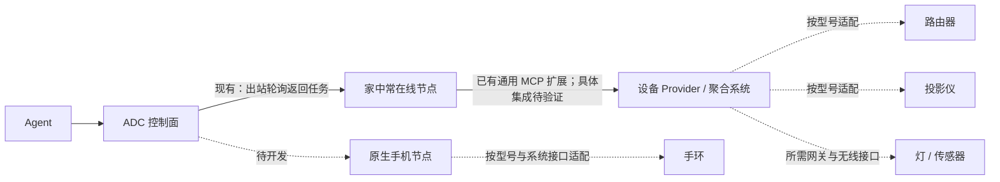

# ADC 设备接入盘点：障碍、接入路径与实现边界

核对日期：2026-09-27。

本次盘点结合当前源码、实现状态和相关生态的官方资料。它是接入能力评估，不是已支持设备清单；没有对用户家中的手机、手环、路由器或极米投影仪进行真机验证。文中建议的数据模型、移动端客户端与设备适配器均未因本次盘点而实现。

## 1. 先明确“接入”要做到什么

设备是否能运行 ADC 客户端，只回答了接入问题的一部分。

| 要达到的程度 | 能说明什么                               | 仍不能据此承诺什么               |
| ------------ | ---------------------------------------- | -------------------------------- |
| 发现设备     | 知道网络或蓝牙范围内有某个对象           | 已识别正确型号、拥有访问权限     |
| 识别并绑定   | 知道它属于哪个账户、用什么方式连接       | 所有功能都能读取或控制           |
| 读取状态     | 能获得温度、电量、网络状态等指定数据     | 数据实时、完整，或可以下发操作   |
| 发出操作     | 能发送调音量、启动任务、设置参数等请求   | 设备已接受或物理动作已完成       |
| 确认结果     | 有设备回报或独立测量证明结果             | 所有异常、断网和重复请求都已处理 |
| 持续可用     | 重启、休眠、断线和升级后仍能恢复约定能力 | 任意型号、任意固件永远兼容       |

因此，兼容性应落实到“型号 × 硬件版本 × 固件 × 接入方式 × 能力”，而不是仅写“支持小米”或“支持极米”。只读传感器接入也有价值，不必以完整控制作为唯一成功标准。

当前最重要的判断：

- **设备不直接上互联网，通常可以由网关补足。** BLE、Zigbee、Thread、USB、串口等各有接入办法。
- **没有开放接口、没有可安装程序的入口，也没有外部控制通道，才是硬边界。** 更换 ADC 的编程语言不能创造这个入口。
- **Node.js 影响直接部署范围，但不是所有设备接入的共同前提。** 外围设备可以由现有电脑节点代理；原生移动端也可以用另一种语言实现协议。
- **当前 ADC 已有通用工具扩展入口，尚没有完整的异构设备管理模型。** “可以包成一个 MCP 工具”和“成为可单独发现、授权、查看状态的设备”仍有距离。

## 2. 接入障碍分别在哪里

| 层面               | 常见情况                                                    | 可以采取的办法                                     | 仍需承担的限制                                   |
| ------------------ | ----------------------------------------------------------- | -------------------------------------------------- | ------------------------------------------------ |
| 物理连接           | 设备没有 Wi-Fi，但有 BLE、USB、串口或其他链路               | 让网关配备对应接口和驱动                           | 有效距离、布线、配对、独占连接                   |
| 无任何可用控制通道 | 只有机械按键，固件封闭，也没有遥控或通信接口                | 人工操作，或另行评估硬件改造                       | 这已经超出普通软件适配                           |
| 网络可达性         | 只有局域网、没有公网 IP、处于 NAT 后                        | 网关在局域网访问设备，再主动连接 ADC               | 网关必须能访问控制面；局域网隔离仍会阻断设备访问 |
| 网络发现           | IP 改变、访客网络隔离、跨 VLAN、多播不可达                  | 稳定身份、重新发现、明确路由和网关部署位置         | “连同一个路由器”不保证协议能互通                 |
| 计算与运行环境     | MCU、RTOS、低内存、MIPS/32 位 ARM、musl、没有进程或文件系统 | 网关代理，或适配轻量客户端                         | TLS、签名、持久化、任务生命周期都需要资源        |
| 系统执行权限       | App 沙箱、不可访问其他应用数据、不能任意启动进程            | 使用系统公开 API，按能力获得权限                   | 安装成功不等于拥有整台设备的控制权               |
| 后台与供电         | 手机限制后台、手环休眠、投影关机后网络模块停止              | 事件唤醒、短任务、状态缓存、外部唤醒通道、常开网关 | 在线能力随工作状态变化；不能默认随时执行         |
| 厂商开放程度       | 私有协议、仅官方 App、SDK 需申请、区域限定                  | 官方 API/SDK、已有集成、明确型号的社区适配         | 可能只开放部分功能；逆向方案有维护成本           |
| 厂商云依赖         | 必须登录、刷新令牌、订阅服务、调用限额                      | 在 Provider 中维护厂商连接，标注云依赖             | ADC 自托管不意味着相关设备也能离线使用           |
| 操作语义与反馈     | “切换电源”而非“设为开启”，指令没有回执，状态来自旧缓存      | 能力契约、状态回读、时间戳、可重复性说明           | 网关发出了信号，不能直接当作设备完成了动作       |
| 持续维护           | 固件升级、接口变化、证书过期、社区项目停止维护              | 版本兼容矩阵、连接诊断、回归验证、适配器维护责任   | 一次演示成功远低于长期支持所需的工作量           |

其中“不能联网”必须进一步拆开：

1. **设备不上互联网，但网关能到达它**：可以桥接，设备无需连接 ADC 云端。
2. **设备与网关都不能访问控制面**：现有云端任务链路不可用；同网内自托管控制面是一种部署选择，断网自治是另一个需要专门实现的问题。
3. **设备睡眠或彻底断电**：网关在线也不等于它在线，需要设备支持唤醒，或接受稍后执行。
4. **设备没有任何可访问的接口**：需要外部控制器、硬件改造或人工步骤。

ADC 的出站轮询已经绕开了“必须给每台设备开放公网端口”的要求，但不提供通用的局域网发现、无线驱动或任意设备的远程唤醒。

## 3. 当前 ADC 自身有哪些限制

下面是源码可确认的实现边界。它们不能全部归结为 Node.js。

| 当前实现                                                                               | 对设备接入的影响                                                                                                    | 源码依据                                                                                                                           |
| -------------------------------------------------------------------------------------- | ------------------------------------------------------------------------------------------------------------------- | ---------------------------------------------------------------------------------------------------------------------------------- |
| 安装包为 macOS/glibc Linux arm64/x64 与 Windows x64                                    | Android、Windows ARM64、常见 OpenWrt、32 位或 MIPS 设备不能直接套用安装流程                                         | [安装器](../deploy/install.sh)、[Windows 安装器](../deploy/install.ps1)、[构建脚本](../scripts/build-node.ts)                      |
| 源码要求 Node.js 22+；分发包构建目标为 Node 24 并捆绑运行时                            | 目标机器无需另装 Node.js，但仍必须兼容捆绑运行时；尚未测量它在路由器上的资源开销                                    | [package.json](../package.json)、[构建脚本](../scripts/build-node.ts)                                                              |
| 平台枚举支持 `darwin`、`linux`、`win32`                                                | 其他新客户端仍需同时扩展配对、能力上报及客户端类型                                                                  | [协议](../packages/protocol/src/index.ts)、[配对 API](../apps/control-plane/src/app.ts)、[客户端](../packages/client/src/index.ts) |
| 内置命令执行按平台使用 Bash 或 PowerShell；服务管理覆盖 launchd/systemd/Task Scheduler | Android、OpenWrt、部分 NAS/容器仍需独立的启动和执行适配                                                             | [执行器](../packages/tool-runtime/src/runtime.ts)、[服务管理](../apps/node/src/service.ts)                                         |
| `NodeDaemon` 固定创建文件/进程 ToolRuntime，并生成内置工具能力                         | 尚未形成只承载相机、传感器或 BLE 功能的通用轻量客户端结构                                                           | [daemon](../apps/node/src/daemon.ts)                                                                                               |
| 调用目标是 `nodeId`，或旧项目放置；授权围绕节点、工具与文件目录                        | 还没有独立的外围设备身份、网关关系与逐设备授权。把设备 ID 放进工具参数不自动得到这些能力                            | [Invocation](../packages/protocol/src/index.ts)、[策略](../packages/policy/src/index.ts)                                           |
| 目标节点离线时拒绝新调用；在线执行依赖轮询、ACK 和续租                                 | 已有断线恢复不等于支持长期睡眠终端的“等唤醒后执行”，也不等于断网本地自治                                            | [策略](../packages/policy/src/index.ts)、[daemon](../apps/node/src/daemon.ts)                                                      |
| MCP Provider 支持 stdio 与 Streamable HTTP，但只接工具发现和调用                       | 可以编排已有适配器；还不是原生 BLE、Matter、Zigbee、ADB 或厂商 SDK 驱动层，也没有通用传感器订阅系统                 | [Provider 管理器](../apps/node/src/mcp-providers.ts)                                                                               |
| HTTP Provider 只允许 HTTPS 或回环 HTTP                                                 | `http://192.168.x.x:8123/api/mcp` 这类常见家庭服务地址不能直接填入当前配置                                          | [Provider 配置](../apps/node/src/config.ts)                                                                                        |
| Provider 使用配置里的请求头；未实现厂商交互登录和令牌自动刷新流程                      | 长期令牌可作为接入方案之一，但多厂商账户绑定和续期仍需适配器承担                                                    | [连接实现](../apps/node/src/mcp-providers.ts)                                                                                      |
| 外部工具统一作为执行风险和副作用；只读、unattended profile 不接受它们                  | 即便是读取温度的 Provider 工具，目前也没有相应的精细风险分类。unattended profile 的限制不代表所有自动调用都不可配置 | [策略](../packages/policy/src/index.ts)、[工具能力](../apps/node/src/mcp-providers.ts)                                             |
| Provider 回执根据工具结果是否 `isError` 判断调用成功                                   | 尚未统一表达“已发送、设备已接受、状态已回读、结果未知”这些物理控制阶段                                              | [Provider 执行](../apps/node/src/mcp-providers.ts)                                                                                 |
| 当前附件进入 PostgreSQL，单项有 25 MiB 限制；任务结果以请求/响应交付                   | 持续摄像、音频流和高频遥测还需要相应的数据传输与存储设计                                                            | [实现状态](implementation-status.md)、[上传 API](../apps/control-plane/src/app.ts)                                                 |

当前回执账本已经提供持久去重和 `unknown_outcome`，这对外围设备控制有价值。但它证明的是 ADC 记录到的执行过程；外围设备不支持回执时，不能凭账本推断物理效果。

另一个实际限制是验证覆盖：五种桌面/服务器目标已经构建出安装包，当前实现状态记录了 macOS arm64 安装链路验证；其他架构、Linux systemd 生命周期和 Windows 原生安装/任务计划程序/NTFS/进程树取消仍有待对应主机验证。不能把“已构建”扩大为“所有相应设备已验证”。见[实现状态](implementation-status.md#deployment-verification)。

## 4. 按设备类别盘点

下表的“接法”是优先评估路径。除现有受支持主机外，其余均不是 ADC 已认证兼容性。

| 设备类别                          | 直接承载当前 ADC node                  | 优先接法                                                                 | 最需要核实的事情                                            |
| --------------------------------- | -------------------------------------- | ------------------------------------------------------------------------ | ----------------------------------------------------------- |
| Mac、标准 glibc Linux 电脑/小主机 | 属于现有安装目标，验证覆盖见上文       | 原生节点；也可承载家庭 Provider                                          | 具体系统版本、持续运行方式、恢复行为                        |
| Windows 10/11 x64 电脑            | 已实现原生 MVP，尚待实机认证           | 原生 PowerShell 节点；WSL2 可另作为 Linux 节点评估                       | Task Scheduler、NTFS、休眠恢复和进程树取消需实机验证        |
| NAS                               | 取决于 CPU、系统、libc 与启动机制      | 满足条件的宿主环境，或另设节点访问 NAS 服务                              | 厂商应用限制、容器/USB 访问、升级后自启动                   |
| 小米等 Android 手机               | 不兼容当前安装流程                     | 原生 Android 能力节点；特定场景可由外部节点通过 ADB 访问                 | Android 版本、后台限制、所需系统权限；Termux 仅是实验环境   |
| 华为手机                          | 未实现专用客户端                       | 按实际系统区分 Android 兼容环境与原生鸿蒙适配                            | 系统版本和 SDK；应用兼容运行不等于后台节点可用              |
| iPhone/iPad                       | 不支持当前客户端                       | 原生受限能力 App、系统允许的后台任务与交互入口                           | 沙箱、后台时机、每项能力可用条件，不按常驻 Linux 主机设计   |
| 小米/华为等手环                   | 不适合安装当前桌面守护进程             | 手机、厂商数据接口或已适配的 BLE 网关                                    | 精确型号/固件、密钥与配对、可读数据、是否仅云端可得         |
| 智能手表                          | 系统差异大，未适配                     | 有应用开发入口的型号可研究轻量 App，否则由手机代理                       | Wear OS/其他系统、联网方式、后台与电量、SDK 范围            |
| 原厂家用路由器                    | 通常没有通用安装入口                   | 厂商接口、开放管理接口或已有集成                                         | 是否有受支持 API/SSH；网页能操作不代表有稳定公开 API        |
| OpenWrt/软路由                    | 当前包通常不直接适配                   | 优先使用已有系统接口；有实测需求再做包和服务适配                         | musl、procd、架构、空间和 RAM；部分机型可运行另装的 Node.js |
| 极米等投影仪、电视、机顶盒        | 不能按品牌统一判定，也无当前专用客户端 | 支持的局域网协议、Android TV Remote、可用的 ADB、HDMI-CEC 或型号专用集成 | 系统/地区/固件、配对、待机时网络是否仍运行、哪些操作有反馈  |
| 灯、插座、空调、窗帘              | 通常无需直接安装 node                  | Home Assistant/厂商网关；Matter、Zigbee、BLE、MQTT 或已验证的本地接口    | 对应型号支持哪个协议；红外控制不天然提供状态回读            |
| 摄像头、门铃                      | 通常优先桥接                           | 支持的 ONVIF、RTSP、厂商 API 或已有录像系统                              | 视频流和控制能力分别核对，云存储授权不等于本地流访问        |
| 打印机、扫描仪                    | 通常无需直装                           | 主机打印/扫描服务、IPP 或厂商驱动                                        | 提交任务、设备接受、打印完成是不同状态                      |
| ESP32 等可编程控制器、传感器      | 不适合运行当前完整客户端               | ESPHome、MQTT 或自定义固件，由网关接入                                   | 是否允许写固件、可用存储/内存、睡眠策略、实际传感器支持     |
| USB/串口仪器、旧设备              | 设备本身可能完全不联网                 | 有驱动的电脑节点，通过 USB/串口 Provider 接入                            | 驱动系统、串口协议、独占使用、物理操作与校准                |
| 完全封闭且无可用外部接口的设备    | 无软件直装或桥接路径                   | 人工，或另行评估可行的外部硬件控制                                       | 改造成本及结果是否能确认                                    |

极米的一个已核实例子是 HORIZON Pro：官方资料列出 Android TV 手机遥控、Chromecast 和 HDMI-CEC。它不能证明其他国内型号具备同样能力；CEC 还需要连接投影仪的 HDMI 设备或适配器。[S5]

普通路由器、运行 OpenWrt 的硬路由、运行标准 Linux 的小主机软路由，也必须分别判断。相同的“路由器”用途并不对应相同的安装环境。

## 5. 可复用的接入路线

### A. 在设备上直接运行客户端

适合完整电脑、服务器，以及未来具备相应客户端的手机。设备自行完成身份注册、接收任务、调用本地能力并返回回执。

优点是直接接近资源、设备可以独立出现；成本是每一种系统都要处理安装、权限、后台、存储、更新和恢复。

当前桌面节点走这条路线。手机不能仅通过把 `platform` 多加一个值就获得完整支持。

### B. 一个常在线节点代理多个设备

适合投影仪、路由器、传感器、手环和 USB 设备。节点放在能访问设备的局域网或近场位置，由 Provider 处理设备协议。

网关需要具备实际的接口：BLE 适配器、Zigbee 协调器、串口或 USB、HDMI-CEC 通道等。Thread 使用 IP 网络，与 Zigbee 不同；Thread 设备需要相应边界路由器与控制协议，看到 Thread 标志不能推断其支持 Matter。[S2]

这条路线可以复用当前 Node.js 客户端，不要求把运行时塞进每个外围设备。代价是网关要常在线，其故障会影响后面的设备；无线距离、发现和配对仍需处理。

网关签名只能证明“这台网关提交了该结果”。如果末端设备本身不签名，不能把它描述为投影仪或传感器独立认证过的结果。

### C. 通过已有设备生态聚合

Home Assistant、ESPHome、现有 NAS/录像系统、厂商网关等可以承担相当一部分底层设备适配。ADC 接它们暴露的能力。

- **Home Assistant** 已提供 MCP Server，使用 Streamable HTTP，端点为 `/api/mcp`，支持 OAuth 或长期访问令牌，并通过暴露给 Assist 的实体控制范围。[S1] 这是一条值得首先验证的 ADC 接入路线，不代表已经联调成功。
- **当前 ADC 到家庭 Home Assistant 的具体限制**：同机回环 HTTP 或可达的可信 HTTPS 符合配置；普通局域网明文 HTTP 不符合当前配置。可评估在节点本地运行 stdio MCP 代理，或配置 HTTPS。Provider 当前可携带令牌请求头，但没有交互 OAuth 登录和自动刷新实现。
- **Matter** 提供一部分标准设备能力及本地控制；配网、Fabric、边界路由器和各版本支持仍有要求。通用 Matter 能力可能少于厂商原生集成，不能据此承诺“所有功能统一”。[S2]
- **ESPHome** 有可被 Home Assistant 等客户端使用的 Native API，采用自定义 TCP/protobuf 协议，也有成熟的主机侧库。它说明小设备可以使用适合自己的协议，由主机桥接；无需直接运行 ADC 的完整客户端。[S3]
- **MQTT** 是消息传输机制。还必须约定主题、消息格式、设备身份、状态含义与确认方式，不能仅凭支持 MQTT 就认为业务互通。

ADC 当前的 Provider 会发现工具并转发调用，不会自动把聚合系统里的每个实体变成 ADC 的独立设备。初期试点可以在聚合系统或适配器里限定可访问实体，后续再补 ADC 自己的逐设备语义。

### D. 经厂商云访问设备

设备可能只接厂商云，没有公开本地接口。Provider 可以在厂商允许的条件下使用云 API。

这可以扩大覆盖，但要记录调用限额、订阅、区域、账户绑定、令牌续期和服务终止风险。数据路径是经厂商云返回，不能把这类能力标为“纯本地”或“断网可用”。

按当前 ADC 职责划分，厂商连接可由用户侧节点的 Provider 执行。把它改成由 ADC 控制面直接代执行，是另一个架构决定，不应在接入时无意引入。

### E. 外部控制或人工协作

红外、HDMI-CEC 等通道可以在目标设备支持时提供有限控制，不必安装目标端软件。接口可能只能发送按键，无法回读结果。

例如，“电源切换”重复执行可能把设备关回去。适配器应声明它是切换还是设置目标状态，并在没有观测依据时返回未确认结果。ADC 的去重机制不能让一个本来没有反馈的遥控协议突然拥有反馈。

完全没有软件可触达通道时，剩下的是外部硬件或人工步骤，需要单独评估成本。

## 6. Node.js 到底是不是问题

它是直接部署时的一部分问题，优先级取决于要覆盖的设备。

| 目标                         | Node.js 的影响                                              | 建议                                                       |
| ---------------------------- | ----------------------------------------------------------- | ---------------------------------------------------------- |
| Mac、Linux、家庭小主机做代理 | 通常具备运行条件，并能复用现成 MCP 生态                     | 保留当前实现，先测实际常驻内存、包大小、恢复时间           |
| OpenWrt、低配 NAS            | 运行时包、libc/架构、依赖、启动机制和资源占用都可能成为障碍 | 先确定机型和需求；可以适配现有运行时，也可以比较轻量实现   |
| Android/原生鸿蒙/iOS         | 关键成本还在系统 API、沙箱、后台与应用分发                  | 使用平台合适的原生客户端，复用 ADC 协议；不必重写控制面    |
| MCU、手环等受限终端          | 完整 Node.js/桌面执行器通常不合适                           | 优先网关；确有独立联网需求且可写固件时，再考虑精简协议实现 |
| 完全封闭的设备               | 换语言不改变可安装性和接口开放程度                          | 找已有接口、网关或外部控制路径                             |

当前客户端与协议库使用 TypeScript/Node.js，不意味着线上协议必须使用相同语言。签名请求、JSON 契约、任务状态和回执可以由其他语言实现，但需要验证同样的行为。

一个原生客户端至少要正确处理身份与密钥、请求签名、能力上报、任务 ACK/续租/取消、持久回执和重连。轻量化需要明确哪些职责由终端承担、哪些由网关承担，不能只删掉实现后仍声称具备同等语义。

因此，暂时没有证据支持“先整体改写为 Rust/Go/C++，设备接入就解决了”。更合理的是在实际部署受阻、资源测量明确以后，对相应客户端作选择。

## 7. ADC 应补的模型与能力

以下都是建议，尚未实现。

### 分开表示设备与连接它的执行端

现在很多场景里，一台电脑既是设备，也是执行端。这种一对一关系对电脑自然，对家电不够。

建议明确：

| 对象     | 含义                                            | 例子                             |
| -------- | ----------------------------------------------- | -------------------------------- |
| 设备     | 用户拥有并希望识别、授权的具体对象              | 客厅投影仪、书房路由器、腕上手环 |
| 执行端   | 能接收 ADC 任务、调用接口、提交回执的客户端     | 小主机节点、手机客户端           |
| 能力     | 该设备经某条连接实际可提供的操作                | 读取状态、设置音量、读取电量     |
| 连接绑定 | 执行端通过哪个 Provider、协议和厂商身份访问设备 | 小主机 → 家居 Provider → 投影仪  |

一台小主机可以代理多个设备，同一台设备也可能有不止一条连接路径。设备身份要尽量稳定，不能仅依赖 IP 地址；多个网关看见同一设备时要避免重复建档和重复执行。

用户仍围绕自己的账户看见“客厅投影仪”，选择允许的能力。执行端和 Provider 关系用于连接、诊断与授权校验，不必要求用户先理解内部层级。

图中的设备适配路线不是当前已交付功能。

### 描述实际可用性与操作结果

至少需要分别表达：

- 执行端是否在线、末端设备是否可达；
- 能力是否可用，是否需要设备处于前台、解锁、充电或待机；
- 状态的来源、采集时间，以及它是现场读取还是缓存；
- 请求是已发送、已接受、已确认完成，还是结果未知；
- 操作是否可以重复、如何取消，以及取消时已经发生了什么。

持续视频和高频遥测要有相应数据通道；低频控制任务继续用任务/回执机制即可。手机的后台规则和电池设备的睡眠周期，应进入能力与调度设计。[S4][S6]

### 授权落实到末端设备与能力

如果一个 Provider 提供“控制任意实体”的工具，仅授权该工具还不能表达“只允许操作客厅投影仪”。

短期可以在 Provider/聚合平台中收窄对象；完整产品需要在设备绑定、工具投影和实际执行中保持同一范围。读取温度、修改网络设置、发送遥控按键也应有各自的能力分类，不能长期都套用桌面文件/命令的划分。

### 将兼容性维护作为正式工作

每个适配应记录：型号与固件、连接方式、已验证能力、已知限制、所需常开设备、认证依赖、最近验证时间和维护者。

状态至少区分“资料显示可行”“实验接通”“场景验证”“持续支持”。对多厂商家庭设备，后两项的成本通常比首次写出调用代码更值得关注。

## 8. 建议推进顺序

这些是优先级，不是已批准的实施任务或交付日期。

| 阶段                   | 工作                                                                      | 为什么先做                                       | 怎样判断有价值                                             |
| ---------------------- | ------------------------------------------------------------------------- | ------------------------------------------------ | ---------------------------------------------------------- |
| P0：验证一条家庭接入链 | 现有 Mac/Linux 节点 → Home Assistant MCP 或单设备 Provider → 一台真实设备 | 最大限度复用现有实现，先暴露连接、授权和反馈问题 | 能明确读取状态、执行一个操作并确认结果；重启和断线后能恢复 |
| P1：补足设备语义       | 独立设备身份、执行端绑定、能力范围、末端状态和结果确认                    | 避免每新增一台家电就继续把设备身份藏在工具参数里 | 一台网关连接多台设备时，发现、授权和故障提示仍准确         |
| P2：扩展移动端         | 根据实际需求先做 Android 的少量原生能力；其他系统逐项规划                 | 手机既是个人设备，也能提供相机、位置和近场连接   | 明确前台/后台可用范围，测量锁屏、休眠、断网及电量影响      |
| P3：选择性扩展部署     | 目标明确的 OpenWrt/NAS 包、轻量客户端或专用硬件                           | 只有在额外部署确实带来收益时承担平台维护         | 相比独立小主机网关，部署、成本或可靠性有可测收益           |

一台家电能否接入，应先问“想使用它的哪项能力”，再选接法。例如只调投影仪音量，通常无需争取完整的目标端运行环境；要让手机采集相机画面，则确实需要处理手机系统能力。

对眼前这批家庭设备，下一步需要收集的最小信息是：

| 信息                                | 用途                                   |
| ----------------------------------- | -------------------------------------- |
| 品牌、精确型号、硬件版本、系统/固件 | 找到准确的兼容依据                     |
| 目前用什么 App、网关或遥控器控制    | 确认已有通道和账户依赖                 |
| 最想实现的一到三项操作              | 区分只读、控制、连续采集及结果确认需求 |
| 家里是否已有常开电脑/NAS/小主机     | 判断能否直接复用网关路径               |
| 待机或断网时是否仍需要工作          | 判断唤醒、本地控制和云依赖是否满足需求 |

## 9. 资料与核查范围

源码链接指向本次核对的本地实现；外部页面为查阅时快照。生态支持情况不会自动转化为 ADC 兼容性。

- **S1** — Home Assistant：[MCP Server](https://www.home-assistant.io/integrations/mcp_server/)。采用其传输、认证、暴露实体和端点说明，未进行 ADC 联调。
- **S2** — Home Assistant：[Matter](https://www.home-assistant.io/integrations/matter/)。用于区分 Matter 与 Thread、本地控制、配网和能力覆盖范围。
- **S3** — ESPHome：[Native API](https://esphome.io/components/api/)。用于说明受限设备可经专用协议被主机系统接入。
- **S4** — Android Developers：[后台启动前台服务的限制](https://developer.android.com/develop/background-work/services/fgs/restrictions-bg-start)。安装 App 和申请权限不代表可随时从后台启动相机、麦克风等能力。
- **S5** — 极米：[HORIZON Pro 支持说明](https://jp.xgimi.com/pages/horizon-pro-support)、[设备常见问题](https://shop.xgimi.com/question-equipment)。能力结论仅适用于页面对应产品。
- **S6** — Apple Developer：[Choosing Background Strategies for Your App](https://developer.apple.com/documentation/backgroundtasks/choosing-background-strategies-for-your-app)。用于说明移动端后台执行依赖系统策略。
- **S7** — OpenWrt：[官方软件包示例](https://downloads.openwrt.org/releases/24.10.0-rc6/targets/armsr/armv7/packages/Packages)。只用于核对 musl 与目标架构这类运行环境差异，不作为推荐版本或兼容认证。

本次没有修改运行代码，没有安装、扫描或控制用户设备，也未重跑与文档无关的代码测试。设备接入能力需要在上述矩阵基础上进一步按真实硬件验证。
