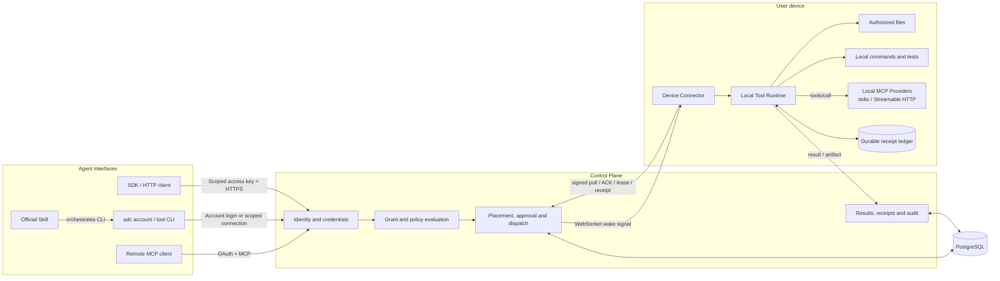
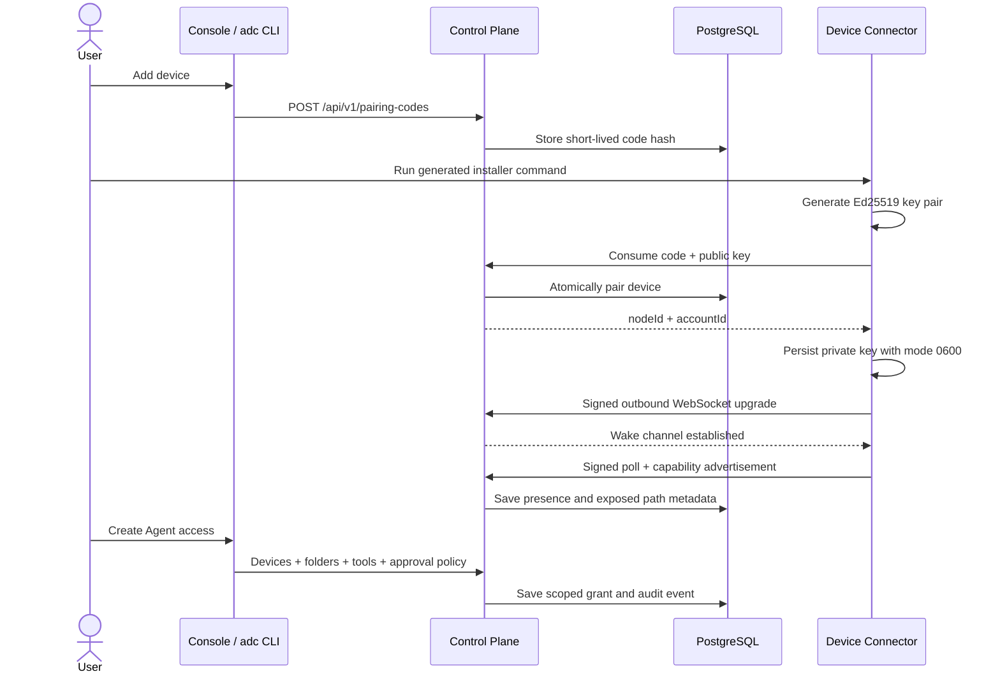
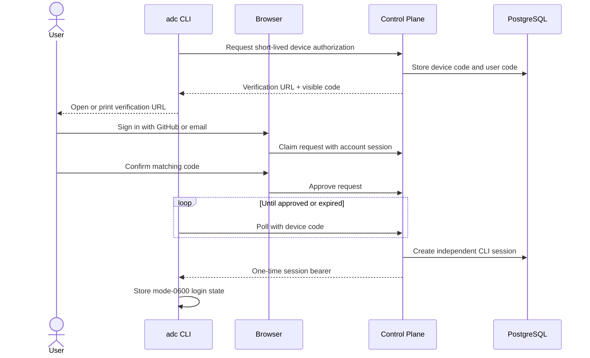
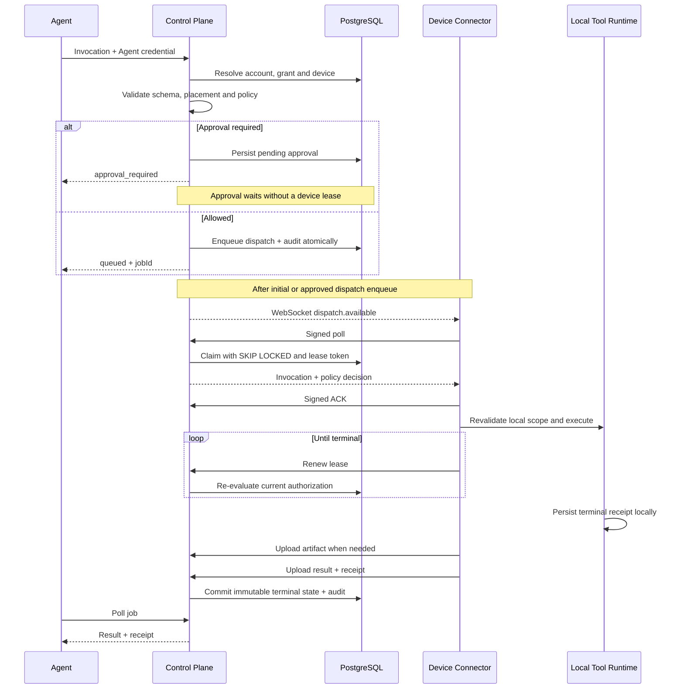
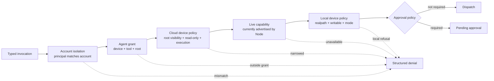
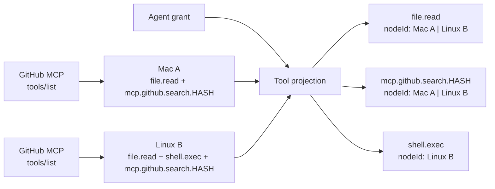
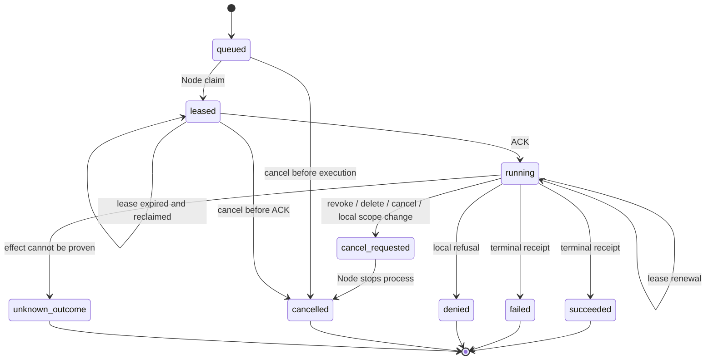
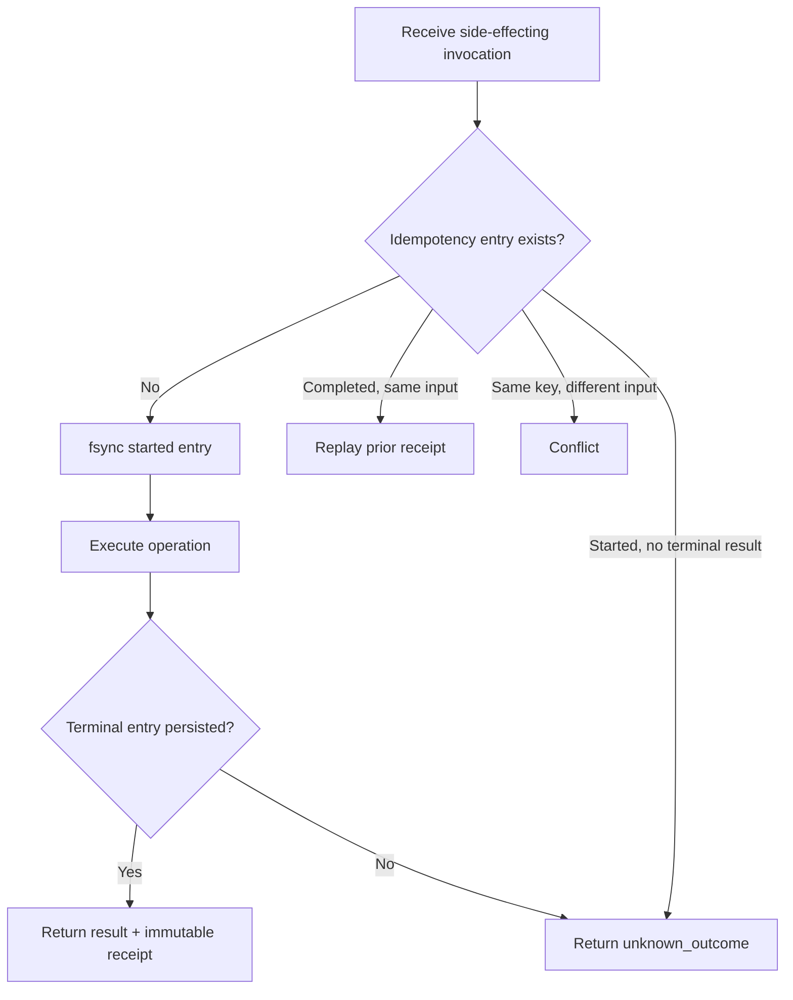

# System architecture

This document is the visual map of the implementation. Solid paths describe current behavior.
Planned components are explicitly marked and must not be read as shipped capability.

## System context

### Source map

| Responsibility                            | Implementation                                                              |
| ----------------------------------------- | --------------------------------------------------------------------------- |
| Invocation, result and capability schemas | `packages/protocol/src/index.ts`                                            |
| Policy intersection                       | `packages/policy/src/index.ts`                                              |
| Authentication and OAuth                  | `apps/control-plane/src/auth.ts`, `apps/control-plane/src/access.ts`        |
| Placement and dispatch API                | `apps/control-plane/src/app.ts`                                             |
| Durable dispatch state                    | `packages/db/src/postgres-store.ts`                                         |
| WebSocket wake, fallback poll and leases  | `apps/control-plane/src/node-wake.ts`, `apps/node/src/daemon.ts`, `wake.ts` |
| Local MCP discovery and routing           | `apps/node/src/mcp-providers.ts`                                            |
| Local execution                           | `packages/tool-runtime/src/runtime.ts`                                      |
| Path safety                               | `packages/tool-runtime/src/path-security.ts`                                |
| Local idempotency ledger                  | `packages/tool-runtime/src/receipt-ledger.ts`                               |
| MCP translation                           | `packages/mcp-adapter/src/index.ts`                                         |
| CLI and shared client                     | `apps/cli/src/main.ts`, `packages/client/src/index.ts`                      |
| Human control surface                     | `apps/console/src/main.tsx`, `apps/console/src/agents.tsx`, `overview.tsx`  |
| Public product and docs                   | `apps/console/src/landing.tsx`, `apps/console/src/docs.tsx`                 |

## Pairing and first authorization

The pairing code is not a device credential. It is consumed once and replaced by a device-generated
key pair. The private key never needs to reach the Control Plane.

The wake connection is also outbound and authenticated with a one-time signed request proof. A wake
contains no invocation payload or authorization decision; it only prompts the Connector to call the
normal signed poll endpoint. Reconnect performs an immediate poll, and a 30-second fallback poll
recovers work if the connection or an individual signal is lost.

## CLI account login

The browser session is never copied into the terminal. The one-time code is bound to the first
signed-in user who opens it, expires after ten minutes and can be redeemed once. CLI management
requests use the resulting revocable account session; device tool calls still use the separately
scoped connection selected by `adc connect`.

## Invocation lifecycle

## Effective authorization

Authorization is a sequence of narrowing gates. Passing one gate never grants permission denied by
another.

The current account layer enforces ownership and identity separation. It is not yet a configurable
organization-wide policy editor.

## MCP tool and target projection

Machine count does not multiply the Agent-facing tool catalog. Before answering `tools/list`, the
Control Plane groups identical logical tools and computes the valid target set from the Agent grant
and each device's latest effective capability.

Each logical tool is returned once. Device-executed tools require the model to choose a
`target.nodeId` from the generated enum. A tool with no valid device instance is omitted. This
projection prevents known-invalid tool/Node combinations from entering the model request, but it is
not an authorization boundary: invocation handling and the selected device still re-evaluate the
grant, effective capability, resource scope and local policy before execution.

A device Connector is an MCP client to each configured local Provider. It discovers tools with
`tools/list`, converts each contract to a stable
`mcp.<provider-id>.<source-name>.<schema-hash>` Tool ID and advertises the JSON Schema through the
normal device capability envelope. The Control Plane never opens the Provider connection and never
receives Provider commands, environment variables or HTTP headers. At execution time it dispatches
an authorized invocation to the selected Node; the Connector maps the stable ID back to the
original Provider tool and performs `tools/call`.

The Provider ID must be consistent across devices for equivalent tools to aggregate. A changed input
or output schema produces a new Tool ID, so an existing grant cannot silently authorize a changed
contract. Custom MCP tools are treated as execution-risk side effects: registration is not
authorization, an idempotency key is mandatory, and read-only/unattended profiles reject them.

## Dispatch state machine

Terminal database states do not regress. An expired lease permits reconciliation, but a side effect
is not automatically re-executed when the local ledger contains an unresolved `started` entry.

## Side-effect durability

The system provides at-least-once delivery with durable deduplication. It intentionally does not
claim exactly-once execution.

## Data ownership

| Data                                       | Control Plane | Device |
| ------------------------------------------ | ------------- | ------ |
| Account, sessions and Agent grants         | Yes           | No     |
| Device public key and disclosed path names | Yes           | Yes    |
| Device private key                         | No            | Yes    |
| Unrequested file content                   | No            | Yes    |
| Invocation arguments and returned result   | Yes           | Yes    |
| Large returned artifact                    | Yes, current  | Yes    |
| Local execution ledger                     | No            | Yes    |
| Dispatch and account audit                 | Yes           | No     |

Artifacts currently use PostgreSQL blobs. External object storage, quotas and retention jobs are
planned, not implemented.

## Current and planned boundaries

```mermaid
flowchart LR
  subgraph Current
    PERSONAL["Personal accounts"]
    MACLINUX["macOS / Linux / Windows Node"]
    ANDROID["Android native capability Node MVP"]
    PROCESS["Restricted process / full trust"]
    POSTGRES["PostgreSQL dispatch + artifacts"]
    INTERFACES["MCP / CLI / Skill / SDK"]
  end

  subgraph Next["Next: production hardening"]
    SIGNED["Signed releases"]
    KEYCHAIN["Keychain / keyring"]
    OBJECTS["External artifact storage + quotas"]
    DOCTOR["Doctor + backup automation"]
  end

  subgraph Later
    CONTAINER["Linux container isolation"]
    TEAM["Teams / RBAC / SSO / SIEM"]
    MOBILE["Additional mobile capabilities / iOS"]
    PLUGINS["Tool plugin ecosystem"]
  end

  Current --> Next --> Later
```

See [product direction](product-direction.md), [threat model](threat-model.md), and
[implementation status](implementation-status.md) for the corresponding product contract,
security details and verified implementation state.

The [device integration assessment](device-integration-assessment.md) inventories mobile,
wearable, router and home-device constraints, gateway options and current implementation gaps.
The Android MVP is the first native mobile implementation; the broader device bindings and adapters
in that assessment remain proposed capabilities.
